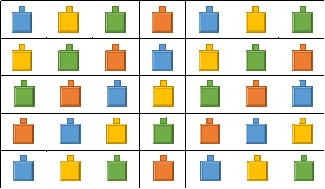

# Задача 08: ColorfulHouses

В некотором коттеджном поселке садовые домики располагаются в виде двухмерного массива размером height x width. Домики имеют разноцветные крыши, при этом цвета повторяются так, как показано на рисунке.

Всего количество цветов colors.

Необходимо написать функцию, которой передается height, width и colors (входные значения именно в таком порядке) и которая вычисляет количество домиков того или иного цвета. Считать самым первым цветом тот, который находится в ячейке [0,0] и далее цвета нумеруются слева направо по строке.

Для примера на рисунке выше (входные значения: 5, 7, 4) ответ должен быть:

синие - 9
желтые - 9
зеленые - 9
красные - 8.

Вывод результатов надо делать в виде последовательности чисел, каждое на новой строке.
