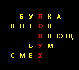

# Задача 09: CrossWord

Разработайте процедуру, которая получает на вход БазуСлов (массив строк), СловоПоВертикали (строка) и выводит на экран микрокроссворд: выделенное цветом СловоПоВертикали пересекается неповторяющимися словами из базы по каждой букве. При невозможности выстроить кроссворд вместо него выводится сообщение об этом.

